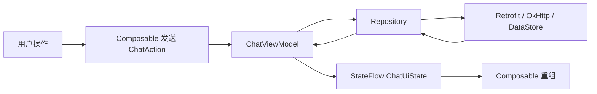

# ChatXP Android 与 Jetpack Compose 开发学习指南

> 面向第一次接触 Android、Kotlin 或 Jetpack Compose 的开发者。
>
> 本文以 `ChatXPandroid/` 的真实源码为样本，从一个 `Text` 如何显示开始，逐步讲到主题、
> 状态提升、ViewModel、Repository、SSE 流式回复和测试。文中的目录和调用链对应当前项目，
> 同时也给出后续新增界面时应遵守的规范。

## 1. 先建立整体认识

ChatXP Android 是一个单 Activity、Compose 驱动的聊天客户端。当前主要能力包括：

- 使用 Material 3 构建浅色和暗色界面。
- 展示会话列表、消息列表、输入框、抽屉、菜单和 Dialog。
- 通过 ViewModel 和 `StateFlow` 管理页面状态。
- 使用 Retrofit 访问普通 JSON API，使用 OkHttp 读取 SSE 流式回复。
- 使用 DataStore 保存匿名身份、Token、当前会话和未完成请求。
- 使用 `multiplatform-markdown-renderer` 展示 Markdown 消息。
- 使用 Preview、JVM 单元测试和 Compose UI 测试验证行为。

可以先把整个应用理解为一条单向流水线：



最重要的原则是：**状态向下传递，事件向上传递**。

- UI 接收状态并显示，不直接请求网络。
- UI 把点击、输入等操作转换成事件。
- ViewModel 处理事件并产生新状态。
- Compose 观察状态变化并自动重新绘制受影响的部分。

## 2. 第一次运行项目

Android 工程位于 `ChatXPandroid/`，需要 Android Studio、Android SDK，以及与当前 Android Gradle
Plugin 兼容的 Android Studio 内置 JDK。项目源码的 Java/Kotlin 字节码兼容级别设置为 Java 11，
这不等于 Gradle 运行时只能使用 JDK 11。

```bash
cd ChatXPandroid
./gradlew assembleDebug
```

在 Android Studio 中运行 `app` 配置即可启动。Debug 构建默认连接：

```text
http://10.0.2.2:8000/
```

`10.0.2.2` 是 Android 模拟器访问宿主机 `localhost` 的特殊地址。使用真机时，应把
`CHATXP_API_BASE_URL` 配置为开发电脑可访问的局域网地址。当前 Debug 地址定义在
`app/build.gradle.kts` 的 `debug.buildConfigField` 中，修改后需要重新构建 App。

常用验证命令：

```bash
./gradlew :app:assembleDebug
./gradlew :app:testDebugUnitTest
./gradlew :app:connectedDebugAndroidTest
```

- `assembleDebug`：编译 Debug APK，能发现导入、类型和资源错误。
- `testDebugUnitTest`：运行不依赖设备的 JVM 单元测试。
- `connectedDebugAndroidTest`：在模拟器或真机上运行 Compose UI 测试。

## 3. 核心源码结构样本

下面是当前项目的核心结构。新页面统一放在 `ui/screens/<feature>/`，不要把页面重新放回
`ui/chat/` 或直接堆在 `ui/` 下。

```text
ChatXPandroid/
├── app/
│   ├── build.gradle.kts                 # Android 模块与依赖
│   └── src/
│       ├── main/
│       │   ├── AndroidManifest.xml       # Application、Activity、权限
│       │   ├── java/com/xipian/chatxp_android/
│       │   │   ├── MainActivity.kt       # Compose 宿主
│       │   │   ├── app/
│       │   │   │   ├── ChatXpApplication.kt
│       │   │   │   ├── AppContainer.kt  # 手工依赖注入
│       │   │   │   └── ChatXpApp.kt      # Theme、Scaffold、页面入口
│       │   │   ├── data/
│       │   │   │   ├── local/           # DataStore
│       │   │   │   ├── model/           # 领域数据模型
│       │   │   │   ├── remote/          # Retrofit、OkHttp、DTO
│       │   │   │   └── repository/      # 数据访问抽象与转换
│       │   │   └── ui/
│       │   │       ├── screens/chat/
│       │   │       │   ├── ChatRoute.kt
│       │   │       │   ├── ChatScreen.kt
│       │   │       │   ├── ChatUiState.kt
│       │   │       │   ├── ChatViewModel.kt
│       │   │       │   ├── component/   # 可组合的聊天 UI
│       │   │       │   └── preview/     # Preview 假数据与容器
│       │   │       ├── theme/            # Color、Type、Shape、Theme
│       │   │       └── token/            # Dimens、Motion
│       │   └── res/
│       │       ├── drawable/             # Vector 图标
│       │       └── values/strings.xml    # 用户可见文案与无障碍文案
│       ├── test/                         # JVM 单元测试
│       └── androidTest/                  # 设备与 Compose UI 测试
├── gradle/libs.versions.toml             # 依赖版本目录
└── settings.gradle.kts                   # Gradle 工程声明
```

### 3.1 按职责理解目录

| 目录 | 负责什么 | 不应该做什么 |
|---|---|---|
| `app/` | 应用入口、全局依赖组装 | 编写具体页面布局 |
| `data/remote/` | HTTP、SSE、请求响应 DTO | 决定界面如何显示错误 |
| `data/local/` | 本地持久化 | 持有 Composable 状态 |
| `data/repository/` | 统一数据来源、DTO 转领域模型 | 引用 Compose 或 Material 3 |
| `ui/screens/` | 页面、状态、事件和页面组件 | 直接创建 Retrofit |
| `ui/theme/` | Material 主题语义 | 保存具体页面业务状态 |
| `ui/token/` | 跨组件尺寸和动效常量 | 放一次性、无复用价值的数字 |
| `res/` | 文案、图标和 Android 资源 | 在 Kotlin 中重复硬编码同一文案 |

## 4. Gradle 与依赖：每个库解决什么问题

依赖别名和版本统一定义在
[`gradle/libs.versions.toml`](../../ChatXPandroid/gradle/libs.versions.toml)，模块通过
[`app/build.gradle.kts`](../../ChatXPandroid/app/build.gradle.kts) 引用。

### 4.1 构建与 Compose

| 依赖或插件 | 用途 |
|---|---|
| Android Gradle Plugin | 编译、打包、安装 Android 应用 |
| Kotlin Compose Plugin | 编译 `@Composable` 函数 |
| Kotlin Serialization Plugin | 为 `@Serializable` DTO 生成序列化代码 |
| Compose BOM | 统一 Compose 库的兼容版本，不逐个填写版本号 |
| Activity Compose | 在 `ComponentActivity.setContent` 中启动 Compose |
| Compose UI | 布局、绘制、Modifier、Preview 基础能力 |
| Material 3 | `MaterialTheme`、`Scaffold`、`Surface`、Dialog 等组件 |

### 4.2 状态与协程

| 依赖 | 用途 |
|---|---|
| Lifecycle Runtime Compose | `collectAsStateWithLifecycle`，只在合适生命周期收集状态 |
| Lifecycle ViewModel Compose | 在 Composable 中取得 ViewModel |
| Kotlin Coroutines | 异步任务、`Flow`、取消和结构化并发 |
| DataStore Preferences | 持久保存 Token、会话 ID 等小型键值数据 |

### 4.3 网络与内容

| 依赖 | 用途 |
|---|---|
| Retrofit | 声明普通 JSON HTTP API |
| OkHttp | 执行网络请求、拦截鉴权并读取 SSE 长连接 |
| Kotlinx Serialization | JSON 与 DTO 之间转换 |
| Multiplatform Markdown Renderer | 将 Markdown AST 渲染为 Compose UI |

### 4.4 测试

| 依赖 | 用途 |
|---|---|
| JUnit 4 | JVM 单元测试入口 |
| Coroutines Test | 控制测试调度器和虚拟时间 |
| MockWebServer | 模拟 HTTP/SSE 服务端 |
| Compose UI Test | 按文本或语义查找节点并执行点击、长按、断言 |

新增依赖时遵循三条规则：

1. 先确认 Android 或现有依赖不能合理解决问题。
2. 在 Version Catalog 中声明版本和别名，不在多个模块散落版本号。
3. 评估维护状态、License、包体积、最低 SDK 和 Compose/Kotlin 兼容性。

## 5. Compose 最小心智模型

### 5.1 `@Composable` 是描述 UI 的函数

传统 View 常通过“找到控件，再修改控件”更新界面；Compose 更接近“给定当前状态，描述当前
界面应该是什么样”。

```kotlin
@Composable
fun SessionTitle(title: String) {
    Text(
        text = title,
        color = MaterialTheme.colorScheme.onSurface,
        style = MaterialTheme.typography.titleSmall
    )
}
```

这个函数没有保存标题，也没有主动刷新 `Text`。当调用者传入的新 `title` 改变时，Compose 会
重新执行需要更新的 Composable，这叫 **重组（recomposition）**。

### 5.2 状态决定 UI

最小的本地状态可以写成：

```kotlin
var query by rememberSaveable { mutableStateOf("") }

ThreadSearchField(
    searchQuery = query,
    onSearchQueryChange = { query = it }
)
```

- `mutableStateOf`：创建 Compose 可观察状态。
- `remember`：跨重组保存，但 Activity 重建后可能丢失。
- `rememberSaveable`：在类型可保存时，进一步跨配置变更恢复。

只属于一个组件的临时显示状态可以放在组件中，例如菜单是否展开。会影响整个页面、网络请求或
需要测试的状态应放进 ViewModel。

### 5.3 状态提升

输入组件不自己决定最终数据，而是接收值和回调：

```kotlin
@Composable
fun ChatComposer(
    composerText: String,
    onComposerTextChange: (String) -> Unit,
    onSendClick: () -> Unit
)
```

这叫 **状态提升（state hoisting）**。它带来三个直接收益：

- 同一个组件能用于 Preview、测试和真实页面。
- 数据只有一个可信来源，不会出现两份输入值不同步。
- 组件不依赖 ViewModel，可以独立复用。

### 5.4 `Modifier` 描述布局和行为

`Modifier` 用于尺寸、间距、点击、背景、语义等。它是有顺序的：

```kotlin
Modifier
    .fillMaxWidth()
    .padding(horizontal = Space4)
    .clickable(onClick = onClick)
```

链条按顺序包裹。`padding().clickable()` 与 `clickable().padding()` 的点击区域可能不同。

本项目规范：

- 可复用 Composable 提供 `modifier: Modifier = Modifier`。
- 由调用者决定组件在父布局中的位置和外部尺寸。
- 组件内部只设置实现自身视觉所需的 Modifier。
- 不在组件参数接收并继续修改一个共享的可变 Modifier；Modifier 本身是不可变值。

## 6. 应用如何启动

启动链路如下：

```text
AndroidManifest.xml
    ↓ 注册
ChatXpApplication
    ↓ 延迟创建 AppContainer
MainActivity.onCreate
    ↓ setContent
ChatXpApp
    ↓ Theme + Scaffold
ChatRoute
    ↓ ViewModel + StateFlow
ChatScreen
    ↓
ChatTopBar / MessageList / ChatComposer / ThreadDrawer
```

### 6.1 `Application` 与 `AppContainer`

[`ChatXpApplication.kt`](../../ChatXPandroid/app/src/main/java/com/xipian/chatxp_android/app/ChatXpApplication.kt)
持有全局唯一的 `AppContainer`。Container 负责创建：

- DataStore `AuthStore`。
- JSON 配置。
- 无鉴权和带鉴权的 OkHttpClient。
- Retrofit API。
- `AuthRepository` 和 `ChatRepository`。

这是一种轻量的**手工依赖注入**。页面不自行 `ChatRepository()`，因此实例生命周期和依赖关系
集中可见。项目规模继续增长后可以评估 Hilt，但当前不应同时混用两套容器。

### 6.2 `MainActivity` 只做 Compose 宿主

[`MainActivity.kt`](../../ChatXPandroid/app/src/main/java/com/xipian/chatxp_android/MainActivity.kt)
只在 `setContent` 中调用 `ChatXpApp()`。Activity 不负责聊天状态和具体布局，这使 UI 更容易预览
和测试。

### 6.3 `ChatXpApp` 处理全局 Theme 与 Insets

[`ChatXpApp.kt`](../../ChatXPandroid/app/src/main/java/com/xipian/chatxp_android/app/ChatXpApp.kt)
用 `ChatXPandroidTheme` 和 Material 3 `Scaffold` 包住页面：

- `Scaffold` 的 `innerPadding` 避免内容与系统状态栏、导航栏重叠。
- `imePadding()` 在软键盘出现时为内容增加 IME Insets。
- 页面必须消费 `innerPadding`，仅写 `Scaffold` 而忽略 padding 仍会重叠。
- Manifest 的 `adjustResize` 与 Compose 的 IME 处理共同保证输入区能接到键盘上方。

不要在每个子组件重复添加系统栏 Insets，否则会形成双倍留白。

## 7. 页面分层：Route、Screen、Component

### 7.1 Route：连接依赖和状态

[`ChatRoute.kt`](../../ChatXPandroid/app/src/main/java/com/xipian/chatxp_android/ui/screens/chat/ChatRoute.kt)
负责：

1. 从 `Application` 取得 `AppContainer`。
2. 创建 `ChatViewModel`。
3. 使用 `collectAsStateWithLifecycle()` 收集 `uiState`。
4. 把状态和 `viewModel::onAction` 传给 `ChatScreen`。

Route 不画具体 UI。它是有状态世界与无状态 Screen 之间的适配层。

### 7.2 Screen：组装整个页面

[`ChatScreen.kt`](../../ChatXPandroid/app/src/main/java/com/xipian/chatxp_android/ui/screens/chat/ChatScreen.kt)
只接收：

```kotlin
uiState: ChatUiState
onAction: (ChatAction) -> Unit
```

它负责组装顶部栏、消息列表、输入区和抽屉，并将组件事件转换为明确的 `ChatAction`。例如：

```kotlin
ChatComposer(
    composerText = uiState.composerText,
    onComposerTextChange = { onAction(ChatAction.ComposerChanged(it)) },
    onSendClick = { onAction(ChatAction.Send) }
)
```

Screen 可以根据状态做轻量展示转换，但不应启动 Retrofit 请求或保存 Token。

### 7.3 Component：小而可复用的界面单元

`component/` 中的组件遵循：

- 参数表达显示状态。
- Lambda 表达用户事件。
- 默认不认识 ViewModel。
- 使用主题、Token 和资源，不硬编码视觉规范或用户文案。
- 有独立视觉价值的组件提供浅色和暗色 Preview。

例如 `MessageList` 决定用户消息使用 `MessageBubble`，助手消息使用
`AssistantMessageItem`；气泡本身不需要知道消息来自网络还是假数据。

## 8. 单向数据流：UiState 与 Action

[`ChatUiState.kt`](../../ChatXPandroid/app/src/main/java/com/xipian/chatxp_android/ui/screens/chat/ChatUiState.kt)
集中定义三个概念：

- `ChatUiState`：某一时刻整个聊天页面的可见状态。
- `ChatAction`：用户或 UI 发出的意图。
- `ChatMessage`、`ChatSession`：只服务于 UI 的展示模型。

典型数据流：

```text
用户输入“你好”
  → ComposerChanged("你好")
  → ViewModel copy(composerText = "你好")
  → StateFlow 发出新 ChatUiState
  → ChatComposer 重组并显示“你好”
```

发送消息时：

```text
点击发送
  → ChatAction.Send
  → ViewModel 校验输入
  → 先插入用户消息和 streaming 助手消息（乐观更新）
  → Repository 打开 SSE
  → Delta 事件逐段追加助手文本
  → Done 事件替换为服务端最终消息
  → UI 随 StateFlow 自动更新
```

### 8.1 为什么使用不可变 `data class`

ViewModel 通过：

```kotlin
_uiState.update { current ->
    current.copy(composerText = newText)
}
```

创建新状态，而不是直接修改旧对象。不可变状态更容易比较、测试和追踪，也符合 Compose 的
声明式模型。

### 8.2 什么状态放在哪里

| 状态类型 | 推荐位置 | 示例 |
|---|---|---|
| 只影响一个组件的短暂视觉状态 | `remember` | 当前按下坐标 |
| 需要跨重组或配置变更的组件状态 | `rememberSaveable` | Dialog 是否打开、编辑中的标题 |
| 页面共享或业务状态 | ViewModel `StateFlow` | 消息、选中会话、是否生成中 |
| 进程重启后仍需恢复 | DataStore / 数据库 / 服务端 | Token、选中会话 ID |

不要把可由其他状态计算出的值保存为第二份状态。例如“发送按钮可用”可以由
`composerText.isNotBlank() && !isGenerating` 推导，避免同步错误。

## 9. ViewModel、协程与生命周期

[`ChatViewModel.kt`](../../ChatXPandroid/app/src/main/java/com/xipian/chatxp_android/ui/screens/chat/ChatViewModel.kt)
是页面业务编排中心。

### 9.1 `viewModelScope`

`viewModelScope.launch` 启动的协程会在 ViewModel 清理时自动取消。网络、延迟搜索和 DataStore
写入都不应使用无生命周期约束的全局协程。

### 9.2 搜索防抖

每次搜索词变化时取消旧 `searchJob`，等待 300ms 再查询。这样连续输入不会为每个字符发起请求。
这里体现了一个通用模式：**新意图使旧结果失去意义时，取消旧任务**。

### 9.3 流式回复与乐观更新

发送时先立即更新 UI，再等待服务端：

1. 创建 `clientRequestId` 和本地消息 ID。
2. 将用户消息和空的助手消息放入 `uiState.messages`。
3. 收到 `meta` 后把草稿会话迁移到服务端会话 ID。
4. 收到 `delta` 后追加内容。
5. 收到 `done` 后使用服务端最终对象覆盖本地对象。
6. 失败或断线时查询 generation 状态恢复。

流式更新频率高，因此列表项必须使用稳定的消息 ID 作为 `LazyColumn` key，不能用列表索引。

### 9.4 错误映射

网络层抛出 `ApiException`，ViewModel 将错误码映射为 `UiError`，Screen 再通过 `strings.xml`
映射用户文案。这样：

- 网络层不依赖 Android UI 资源。
- ViewModel 测试不依赖具体中文文案。
- UI 可以按语言和主题显示错误。

## 10. 数据层与依赖方向

推荐依赖方向：

```text
UI → ViewModel → Repository interface → Repository implementation
                                      → Retrofit API / SSE client / DataStore
```

反方向依赖是不允许的。例如 Repository 不能导入 `ChatScreen`，DTO 不能引用
`MaterialTheme.colorScheme`。

### 10.1 DTO、领域模型与 UI 模型

项目中存在三种数据形状：

| 类型 | 所在层 | 示例 | 目的 |
|---|---|---|---|
| DTO | `data/remote/dto` | `MessageDto` | 精确匹配 JSON 契约 |
| 领域模型 | `data/model` | `ChatMessageModel` | 隔离网络字段命名 |
| UI 模型 | `ui/screens/chat` | `ChatMessage` | 表达界面真正需要的信息 |

不要为了少写一次转换就让 UI 直接使用 DTO。服务端字段变化时，DTO 到领域模型的转换是清晰的
隔离边界。

### 10.2 Repository interface 便于测试

`ChatViewModel` 依赖 `ChatDataRepository` 接口，而不是具体 `ChatRepository`。测试可以传入
`FakeChatRepository`，不需要真正启动服务器。这就是依赖倒置在当前项目中的实际用途。

### 10.3 Retrofit 与 OkHttp 的分工

- 普通请求响应 API 使用 Retrofit，声明清晰且自动转换 JSON。
- SSE 是持续读取的文本事件流，项目直接使用 OkHttp 逐行解析。
- `BearerInterceptor` 附加 Token，`TokenAuthenticator` 在鉴权失败时刷新 Token。
- SSE Client 使用无限读取超时，但仍绑定协程取消，页面任务结束时取消 OkHttp Call。

## 11. 设计系统：Theme 与 Token

界面不能在各文件中随意写颜色、字号、圆角和核心尺寸。当前设计系统分为两层。

### 11.1 Material Theme 语义

`ui/theme/` 定义：

- `Color.kt`：浅色、暗色 `ColorScheme`。
- `Type.kt`：`ChatTypography`。
- `Shape.kt`：全局 Shape 和特殊 Dialog/Drawer Shape。
- `Theme.kt`：根据系统暗色模式选择并注入 `MaterialTheme`。

页面优先使用语义颜色：

```kotlin
MaterialTheme.colorScheme.background
MaterialTheme.colorScheme.surfaceVariant
MaterialTheme.colorScheme.onSurface
MaterialTheme.colorScheme.error
```

不要在页面写 `Color(0xFFF5F5F5)`。同一个语义在暗色主题下应自动切换为不同值。

字体同理：

```kotlin
MaterialTheme.typography.titleMedium
MaterialTheme.typography.bodyMedium
MaterialTheme.typography.labelSmall
```

不要在页面重复写 `fontSize = 14.sp`、`fontWeight = FontWeight.Normal`。

### 11.2 尺寸与动效 Token

`ui/token/Dimens.kt` 保存跨组件的布局规范，例如：

- `IconButtonSize`
- `MessageListHorizontalPadding`
- `ComposerShellMinHeight`
- `DrawerWidthFraction`

`ui/token/Motion.kt` 保存时长、缓动和透明度，例如：

- `FastDurationMillis`
- `BaseDurationMillis`
- `StandardEasing`
- `DisabledAlpha`

是否应该新增 Token，可以用这个判断：

- 是设计规范或会被多个位置使用：新增语义 Token。
- 只属于一个实现细节，且没有复用意义：可以保留为组件私有常量。
- 已有同义 Token：复用，不创建近义名称。

### 11.3 Shape 规则

- 按钮、输入框等胶囊组件使用 `MaterialTheme.shapes.*` 或 `ChatCorner.Pill`。
- 用户消息和 Dialog 使用固定圆弧 `ChatCorner.Dialog`，避免长内容变成夸张胶囊。
- 圆形按钮必须宽高相等，再使用 50% Shape。
- 左侧抽屉贴边，使用 `RectangleShape`，不添加圆角。

## 12. 字符串、图标与无障碍

所有用户可见文字、可翻译文字和内容描述统一放在
[`res/values/strings.xml`](../../ChatXPandroid/app/src/main/res/values/strings.xml)。

```kotlin
Text(text = stringResource(R.string.drawer_title))
Icon(
    painter = painterResource(R.drawable.menu),
    contentDescription = stringResource(R.string.icon_menu)
)
```

规范：

- Kotlin 中不硬编码“删除”“发送失败”等用户文案。
- 可参数化文案使用 `%1$s` 等占位符。
- 纯装饰图标可以使用 `contentDescription = null`。
- 可点击且没有邻近文字说明的图标必须有准确内容描述。
- 图标放在 `res/drawable/`，优先使用 Vector Drawable 或项目现有图标库。
- Preview 假数据中的可见文案也应使用资源，便于统一检查和本地化。

## 13. 布局与交互规范

### 13.1 使用 `Row`、`Column`、`Box`

- `Row`：水平排列，例如顶部栏按钮。
- `Column`：垂直排列，例如标题和说明。
- `Box`：层叠或对齐，例如右对齐用户气泡、抽屉覆盖主页面。

`weight(1f)` 表示占据父布局剩余空间。只在 `RowScope` 或 `ColumnScope` 中使用，并确认是否真的
希望组件拉伸。

### 13.2 长列表使用 `LazyColumn`

消息和会话列表使用 `LazyColumn`，只组合当前可见项。必须提供稳定 key：

```kotlin
items(
    items = messages,
    key = { message -> message.id }
) { message ->
    // item UI
}
```

不要用 `key = { index }` 表示可增删、可排序的数据，否则状态和动画可能绑定到错误项目。

### 13.3 点击区域与图标尺寸分开

`IconButtonSize = 48.dp` 表示舒适点击区域，`IconSize = 22.dp` 表示图标本体。不要为了图标看起来
小就把整个可点击区域缩小。

### 13.4 输入框与键盘

- `BasicTextField` 适合完全自定义输入框外观。
- 输入值由 ViewModel 管理，Preview 可以用 `rememberSaveable` 提供本地状态。
- App 根 `Scaffold` 负责系统 Insets 和 `imePadding`。
- 输入区本身只负责组件内边距，不重复添加导航栏/IME Insets。
- 发送条件由当前输入和生成状态推导，空白内容不能发送。

### 13.5 菜单、Dialog 和手势

- 普通点击和长按并存时使用 `combinedClickable`。
- 锚定菜单的坐标应在长按发生时冻结，点击菜单项时不要再次用新的触点更新锚点。
- Dialog 编辑中的临时文本属于 Dialog 本地状态，确认后才向上发送业务事件。
- 删除等破坏性操作必须二次确认，并使用 `colorScheme.error`。
- 抽屉打开时使用 `BackHandler` 优先关闭抽屉，不改变当前会话。

## 14. Markdown 是复杂组件的封装样本

Markdown 不是简单 `Text`，当前项目通过
[`ChatMarkdown.kt`](../../ChatXPandroid/app/src/main/java/com/xipian/chatxp_android/ui/screens/chat/component/markdown/ChatMarkdown.kt)
封装第三方渲染器。

这层封装统一处理：

- Material 3 颜色和字体。
- 标题、列表、引用、代码块和表格组件。
- 加载或解析失败时回退为普通文本。
- 流式内容状态保留。
- Markdown 无障碍文案。
- 只允许 `http` 和 `https` 链接，拒绝危险 URI Scheme。
- 用户气泡首个 Markdown 块的额外间距修正。

重要规范：业务组件只调用 `ChatMarkdown(content)`，不要在每个消息组件里重复配置第三方库。
第三方 API 变化时，只需在 Markdown 封装层适配。

用户气泡和助手消息可以传入不同样式参数，但两者继续共用同一渲染入口。这样既保留 Markdown
能力，也避免出现纯文本和 Markdown 两套布局行为不一致。

## 15. Preview：先隔离视觉，再运行整页

Preview 用于快速检查组件，不替代测试和真机运行。

项目使用 `ChatPreviewFrame` 统一提供：

- `ChatXPandroidTheme`。
- Material 3 `Scaffold`。
- 系统栏安全区域。
- 浅色和暗色预览。

推荐模板：

```kotlin
@ChatComponentPreview
@Composable
private fun ExamplePreview() {
    ChatPreviewFrame {
        ExampleComponent(
            title = stringResource(R.string.preview_example_title),
            onClick = {}
        )
    }
}
```

规范：

- 新增可见组件时提供 Preview。
- 至少检查浅色和暗色；可复用 `@ChatComponentPreview` 一次声明两种模式。
- 全屏组件使用 `Scaffold` 并消费 `innerPadding`，避免与状态栏重叠。
- Preview 使用 `preview/` 下的数据，不创建真实 Repository 或发网络请求。
- 长文本、空数据、错误、禁用、选中等关键状态应有针对性样本。

## 16. 测试分层

### 16.1 JVM 单元测试

位置：`app/src/test/`。

适合验证：

- ViewModel 状态转换。
- 搜索、置顶、重命名、删除规则。
- SSE 事件解析和重复序列处理。
- Markdown 链接安全策略。
- Repository 错误转换。

ViewModel 测试应传入 Fake Repository 和 Fake CredentialStore，并使用 Coroutines Test 控制任务。
不要为了测试 ViewModel 启动 Activity 或真实服务器。

### 16.2 Compose UI 测试

位置：`app/src/androidTest/`。

适合验证：

- 长按是否打开菜单。
- 菜单项顺序、文本和启用状态。
- 点击、输入、滚动后的节点状态。
- Markdown 关键内容是否显示。

优先通过语义、文本和 content description 查找节点，不依赖屏幕绝对像素坐标。

### 16.3 测试范围随风险增长

- 修改颜色或间距：Preview + 编译通常是最低要求。
- 修改组件交互：增加 Compose UI 测试。
- 修改 ViewModel 状态机：增加 JVM 单元测试。
- 修改网络协议或 SSE：增加 MockWebServer/解析测试，并与 API 契约核对。

## 17. 新增一个 Compose 页面时的标准流程

假设新增设置页面，建议目录：

```text
ui/screens/settings/
├── SettingsRoute.kt
├── SettingsScreen.kt
├── SettingsUiState.kt
├── SettingsViewModel.kt
├── component/
└── preview/
```

执行顺序：

1. 明确页面状态、用户事件和不属于本阶段的范围。
2. 在 `SettingsUiState` 定义不可变状态和 `SettingsAction`。
3. 先写无状态 `SettingsScreen(uiState, onAction)`。
4. 将重复或复杂区域拆到 `component/`。
5. 使用 Theme、Dimens、Motion 和 `strings.xml`，不写核心硬编码值。
6. 为组件和整页添加浅色、暗色及边界状态 Preview。
7. 实现 ViewModel，让状态通过 `StateFlow` 暴露。
8. 通过 Repository interface 获取数据，不让 UI 访问 Retrofit。
9. 在 Route 中创建 ViewModel 并用生命周期安全方式收集状态。
10. 接入 App 导航或入口。
11. 按风险补充单元测试和 UI 测试。
12. 运行编译、测试，并在模拟器或真机检查系统栏和键盘。

### 17.1 Screen 模板

```kotlin
@Composable
fun SettingsScreen(
    uiState: SettingsUiState,
    onAction: (SettingsAction) -> Unit,
    modifier: Modifier = Modifier
) {
    Column(
        modifier = modifier
            .fillMaxSize()
            .background(MaterialTheme.colorScheme.background)
    ) {
        // 只根据 uiState 组装界面并向上发送 action
    }
}
```

### 17.2 Route 模板

```kotlin
@Composable
fun SettingsRoute(modifier: Modifier = Modifier) {
    val viewModel: SettingsViewModel = viewModel(factory = /* factory */)
    val uiState by viewModel.uiState.collectAsStateWithLifecycle()

    SettingsScreen(
        uiState = uiState,
        onAction = viewModel::onAction,
        modifier = modifier
    )
}
```

## 18. 本项目 Compose 开发规范清单

提交前逐项检查：

### 结构与职责

- 页面位于 `ui/screens/<feature>/`。
- Route 连接 ViewModel，Screen 组装 UI，Component 保持可复用。
- UI 不直接访问 Retrofit、OkHttp、DataStore 或 Repository 实现。
- Repository 和网络层不依赖 Compose。

### 状态与事件

- 页面只有一个可信 `UiState` 来源。
- 状态不可变，通过 `copy` 和 `StateFlow.update` 更新。
- 状态向下，事件向上；组件不直接持有页面 ViewModel。
- 可推导值不重复保存，异步任务绑定 `viewModelScope`。

### 视觉与资源

- 颜色使用 `MaterialTheme.colorScheme`。
- 字体使用 `MaterialTheme.typography`。
- 圆角使用 `MaterialTheme.shapes` 或 `ChatCorner`。
- 核心尺寸和动效使用 `ui/token`。
- 用户可见文字和无障碍文案使用 `strings.xml`。
- 图标使用 `drawable` 资源，点击区域不小于规范尺寸。

### Compose 布局

- 对外暴露 `modifier: Modifier = Modifier`。
- 注意 Modifier 顺序，不用负偏移掩盖布局问题。
- 长列表使用 `LazyColumn` 和稳定 key。
- 不设置会裁切动态文字的固定高度，必要时使用 `heightIn`。
- App 根层统一处理系统栏和 IME Insets，子组件不重复消费。

### 预览与测试

- 新组件提供浅色和暗色 Preview，并使用 `ChatPreviewFrame`。
- Preview 不调用真实网络。
- 状态机变化有 JVM 测试，重要交互有 Compose UI 测试。
- 至少运行 `:app:assembleDebug` 和受影响测试。

## 19. 初学者推荐阅读顺序

不要第一天就从 SSE 解析开始。按下面顺序阅读，理解成本更低：

1. `Type.kt`、`Color.kt`、`Dimens.kt`：认识设计值如何集中管理。
2. `EmptyChatState.kt`：学习最简单的 `Column`、`Text` 和主题。
3. `ChatTopBar.kt`：学习 `Row`、`weight`、图标、点击和 Preview。
4. `ChatComposer.kt`：学习状态提升、`BasicTextField` 和启用状态。
5. `MessageBubble.kt`、`MessageList.kt`：学习约束、`LazyColumn` 和稳定 key。
6. `ChatScreen.kt`：理解页面如何组装组件、处理 Insets 和分发事件。
7. `ChatUiState.kt`、`ChatRoute.kt`：理解单向数据流和生命周期收集。
8. `ChatViewModel.kt`：学习协程、StateFlow、状态机和任务取消。
9. `ChatRepository.kt`、`ChatXpApi.kt`：理解数据层边界和 DTO 转换。
10. `ChatStreamClient.kt`：最后学习 SSE、Flow、线程切换和取消传播。

完成这条路径后，再阅读 `component/markdown/`。Markdown 同时包含第三方库适配、样式覆盖、
安全策略和流式渲染，是当前 UI 中复杂度最高的独立组件之一。

## 20. 常见错误与修正方向

| 常见错误 | 后果 | 正确方向 |
|---|---|---|
| 在 Composable 中直接发网络请求 | 重组可能重复请求，难测试 | 由 ViewModel 调 Repository |
| 组件内部复制一份父级状态 | 两份状态不同步 | 状态提升，传值和回调 |
| 页面硬编码颜色和 dp/sp | 暗色与规范失效 | 使用 Theme 与 Token |
| Kotlin 硬编码用户文案 | 无法本地化且难统一 | 使用 `strings.xml` |
| `Scaffold` 不消费 `innerPadding` | 内容与系统栏重叠 | 将 padding 传给页面根 Modifier |
| 每层都加 Insets | 出现双倍顶部或底部空白 | 只在明确的所有者层处理 |
| `LazyColumn` 使用索引作为 key | 排序删除后状态错位 | 使用服务端稳定 ID |
| 用固定高度解决文字对齐 | 多行或大字体被裁切 | 修正行高、padding 和约束 |
| 将异常文案写进 Repository | 数据层依赖 UI 和语言 | 映射为错误类型，UI 取资源 |
| 每个页面直接配置 Markdown 库 | 样式和安全策略分裂 | 统一通过 `ChatMarkdown` 封装 |

## 21. 当前样本的边界

本文描述的是当前 ChatXP Android 架构，不代表所有 Android 项目都必须完全相同。当前工程尚未
引入 Navigation Compose、Hilt、多模块或 Room，因为现阶段只有一个主要页面，手工依赖注入和
单模块结构仍然清晰。

只有在复杂度真实出现时再演进：

- 出现多个页面和返回栈：引入 Navigation Compose。
- 依赖图明显扩大且手工 Factory 重复：评估 Hilt。
- 需要离线会话和复杂查询：评估 Room。
- 团队和构建规模扩大：按 feature/data/core 拆 Gradle 模块。

不要为了“看起来像大型项目”提前增加层级。好的架构不是目录最多，而是职责清晰、依赖方向稳定、
状态可预测并且容易测试。
