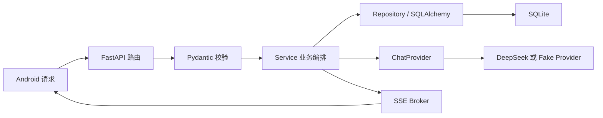
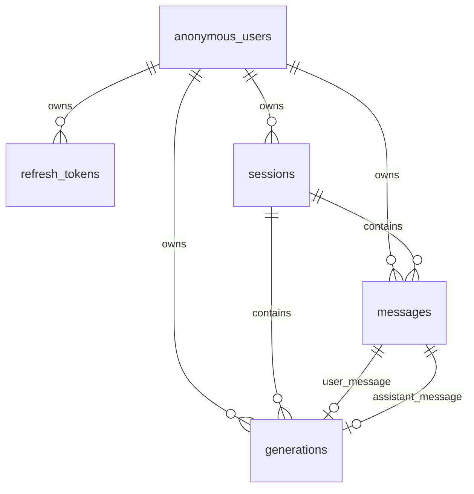
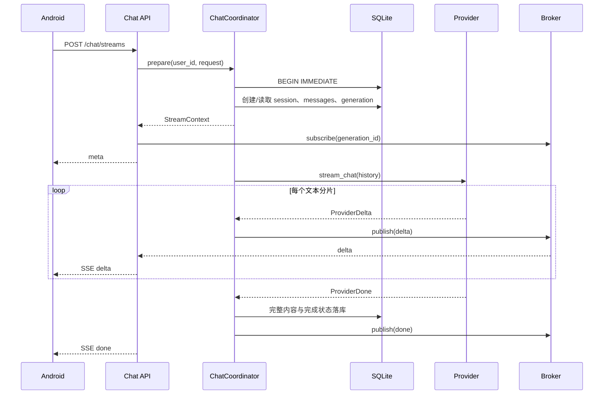

# ChatXP 后端开发学习指南

> 面向第一次接触 Python Web 后端、FastAPI 或分层架构的开发者。
>
> 本文不只介绍“代码放在哪里”，还会解释每一层为什么存在、一次请求如何流动、
> 怎样安全地增加功能，以及当前项目为什么选择这些依赖和约束。

## 1. 先建立整体认识

ChatXP 后端是一个异步 FastAPI 服务，当前负责以下工作：

- 为 Android 设备创建和恢复匿名身份。
- 签发 access token，并轮换 refresh token。
- 提供公开的模型目录，不向客户端暴露真实 Provider 模型名。
- 保存会话、用户消息、助手消息和生成任务。
- 调用 OpenAI-compatible 模型服务，目前真实模型为 `deepseek-v4-flash`。
- 通过 SSE 将模型输出实时推送给客户端。
- 在客户端断线后继续生成，并允许客户端查询生成结果。

可以先把后端理解为一条流水线：



这里最重要的概念是：**每一层只负责一种类型的问题**。

- 路由层理解 HTTP。
- Schema 理解请求和响应的数据形状。
- Service 理解业务规则。
- Repository 理解数据库查询。
- Provider 理解外部模型接口。
- Streaming 理解 SSE 和订阅关系。

如果把所有逻辑都写进一个路由函数，短期看起来简单，功能增加后却会难以测试、复用和维护。

## 2. 第一次运行项目

后端位于 `server/`。需要 Python 3.12 和 `uv`。

```bash
cd server
cp .env.example .env
./run.sh
```

默认监听 `0.0.0.0:8000`。本机可以访问：

- `http://127.0.0.1:8000/health/live`
- `http://127.0.0.1:8000/health/ready`
- `http://127.0.0.1:8000/docs`
- `http://127.0.0.1:8000/openapi.json`

手机与电脑处在同一局域网时，手机应使用电脑的局域网 IP，例如：

```text
http://192.168.1.20:8000
```

### 2.1 Fake Provider 和真实 Provider

默认配置使用 Fake Provider，不访问外网，回复形式为：

```text
Echo: <最后一条用户消息>
```

这很适合本地开发和自动化测试，因为结果稳定、速度快、没有调用费用。

真实 Provider 通过 `.env` 配置：

```dotenv
CHATXP_CHAT_PROVIDER=openai
AI_BASE_URL=https://example.com/v1
AI_API_KEY=your-secret-key
```

公开模型 ID `chat-5.5`、`chat-5.6` 会在服务端分别映射到
`deepseek-v4-flash`、`deepseek-v4-pro`。客户端只使用公开 ID 和
`standard`、`advanced` 思考程度，因此以后更换上游模型时不必修改 Android 的接口结构。

注意：

- `.env` 包含密钥，已经被 `.gitignore` 忽略，绝不能提交。
- `.env.example` 只保存字段示例，不能放真实密钥。
- 不要在日志、异常信息或测试输出中打印 API key、refresh token 和 installation secret。

## 3. 目录结构：代码为什么这样放

```text
server/
├── pyproject.toml           # 项目元数据、依赖和工具配置
├── uv.lock                  # 锁定依赖的精确版本
├── .env.example             # 环境变量样例
├── run.sh                   # 一键启动入口
├── alembic.ini              # Alembic 配置
├── migrations/              # 数据库迁移
│   └── versions/
├── scripts/
│   └── export_openapi.py    # 导出 OpenAPI 契约
├── src/chatxp/
│   ├── main.py              # application factory 与生命周期
│   ├── cli.py               # chatxp 命令行入口
│   ├── api/                 # HTTP 路由、依赖、中间件、错误处理
│   ├── core/                # 配置、安全、时间、日志、游标
│   ├── db/                  # Engine、ORM 表和迁移启动器
│   ├── schemas/             # Pydantic 请求与响应模型
│   ├── repositories/        # 数据库查询
│   ├── services/            # 业务规则和流程编排
│   ├── providers/           # 模型服务抽象和实现
│   └── streaming/           # SSE 编码与内存订阅 Broker
└── tests/
    ├── unit/                # 无数据库或少量依赖的快速测试
    ├── integration/         # API、SQLite 和业务流程测试
    ├── contract/            # OpenAPI 契约测试
    └── fixtures/            # 固定的 SSE JSON 样本
```

### 3.1 为什么使用 `src` layout

Python 包放在 `src/chatxp/`，而不是直接放在项目根目录。这可以防止测试因为当前目录恰好
包含源码而“意外导入成功”。安装和测试时必须真正按包的方式导入代码，更接近部署环境。

### 3.2 为什么测试不放在源码目录

业务代码和测试代码的用途不同：

- `src/chatxp/` 是会被安装和运行的产品代码。
- `tests/` 是验证产品代码的开发资源。

分开后，打包产物更干净，也更容易按单元、集成和契约划分测试。

## 4. 依赖：每个库解决什么问题

依赖统一定义在 [`server/pyproject.toml`](../../server/pyproject.toml)。

### 4.1 运行时依赖

| 依赖 | 用途 | 在项目中的位置 |
|---|---|---|
| FastAPI | 声明 HTTP 路由、依赖注入、OpenAPI | `api/`、`main.py` |
| Uvicorn | 运行 ASGI 应用 | `cli.py` |
| Pydantic v2 | 校验请求和构造响应 DTO | `schemas/` |
| pydantic-settings | 从 `.env` 和环境变量读取配置 | `core/config.py` |
| SQLAlchemy 2 async | ORM、查询和异步事务 | `db/`、`repositories/`、`services/` |
| aiosqlite | 为 SQLite 提供异步驱动 | 数据库 URL |
| Alembic | 管理数据库结构变更 | `migrations/` |
| httpx | 异步调用模型 Provider | `providers/openai_compatible.py` |
| PyJWT | 创建和验证 access token | `core/security.py` |
| greenlet | 支持 SQLAlchemy 的部分异步桥接 | SQLAlchemy 运行时 |

### 4.2 开发依赖

| 依赖 | 用途 |
|---|---|
| pytest | 测试框架 |
| pytest-asyncio | 运行异步测试 |
| asgi-lifespan | 在测试中正确启动和关闭 FastAPI lifespan |
| Ruff | 代码风格、导入顺序和常见错误检查 |
| Mypy | 静态类型检查 |

### 4.3 `pyproject.toml` 与 `uv.lock` 的区别

- `pyproject.toml` 描述允许的版本范围，例如 `fastapi>=0.115,<1`。
- `uv.lock` 记录实际解析出的精确版本和完整依赖树。

开发者修改依赖时应修改 `pyproject.toml` 并让 `uv` 更新锁文件，不要手工编辑 `uv.lock`。

## 5. 分层规则：最核心的开发规范

推荐依赖方向如下：

```text
API ────────> Schema
 │
 └──────────> Service ───────> Repository ───────> DB Tables
                    │
                    ├────────> Provider
                    └────────> Streaming

Core 可以被各层使用，但 Core 不应反向依赖业务层。
```

### 5.1 API 层

目录：`src/chatxp/api/`

职责：

- 声明 URL、HTTP 方法和状态码。
- 从 path、query、header 和 body 中接收参数。
- 通过 `Depends` 获取当前用户。
- 调用 Service。
- 返回响应 DTO 或 `StreamingResponse`。

不应负责：

- 直接编写复杂 SQL。
- 直接调用 DeepSeek。
- 决定跨多个表的事务步骤。
- 拼装大量业务分支。

一个路由函数应该尽量像“HTTP 到业务方法的适配器”。

### 5.2 Schema 层

目录：`src/chatxp/schemas/`

Schema 是外部契约的数据模型，例如：

- `ChatStreamRequest`：发送聊天请求。
- `SessionDto`：会话响应。
- `MessageDto`：消息响应。
- `ErrorEnvelope`：统一错误结构。

Schema 与 ORM Table 不同：

- Schema 面向客户端，关心字段是否可空、格式和枚举。
- ORM Table 面向数据库，关心列类型、外键、索引和约束。

不要直接把 ORM 对象作为接口响应。应通过 Presenter 或显式 DTO 转换，防止数据库新增字段后
被意外暴露给客户端。

### 5.3 Service 层

目录：`src/chatxp/services/`

Service 负责业务规则和流程编排，例如：

- 验证模型是否存在。
- 判断会话是否属于当前用户。
- 创建会话、两条消息和 generation。
- 刷新 token 并撤销旧 token。
- 判断删除会话时是否存在运行中的生成任务。

Service 可以协调 Repository、Provider 和 Streaming，但不应该理解具体 HTTP Response 对象。

### 5.4 Repository 层

目录：`src/chatxp/repositories/`

Repository 负责可复用的数据访问：

- 按 `user_id + session_id` 查询会话。
- 构建会话列表投影。
- 查询用户或 refresh token。
- 判断会话是否存在活跃 generation。

Repository 不返回 HTTP 状态码，也不决定错误文案。找不到数据之后应该返回 `None`，由 Service
根据业务场景决定返回 `SESSION_NOT_FOUND` 还是 `AUTH_INVALID`。

### 5.5 Provider 层

目录：`src/chatxp/providers/`

`ChatProvider` 是一个协议，业务层只依赖它，不依赖具体厂商：

```python
class ChatProvider(Protocol):
    def stream_chat(
        self,
        provider_model: str,
        messages: Sequence[ProviderMessage],
    ) -> AsyncIterator[ProviderEvent]: ...
```

因此测试可以传入 Fake Provider，真实环境可以传入 OpenAI-compatible Provider。

### 5.6 Core 层

目录：`src/chatxp/core/`

这里放与具体业务实体关系较弱的基础能力：

- 环境配置。
- JWT 和摘要算法。
- UTC 时间。
- 日志配置。
- 防篡改分页游标。

不要把“删除会话”之类的业务逻辑放进 Core。

## 6. 应用如何启动

入口是 [`server/src/chatxp/main.py`](../../server/src/chatxp/main.py)。`create_app()` 使用 application
factory 模式创建 FastAPI 实例，方便测试传入独立配置。

生命周期按以下顺序执行：

1. 将 readiness 设为 false。
2. 执行 Alembic migration。
3. 配置日志。
4. 创建异步数据库 Engine 和 Session Factory。
5. 根据环境配置构建公开模型目录。
6. 创建 Fake 或 OpenAI-compatible Provider。
7. 创建 Auth、Session 和 Chat Service。
8. 修复上次进程退出后遗留的 `queued/streaming` generation。
9. 将 readiness 设为 true，开始接收业务请求。
10. 关闭时取消后台任务并释放数据库连接。

这解释了两个健康检查的区别：

- `/health/live`：进程还活着。
- `/health/ready`：初始化完成，数据库可用，可以接收请求。

## 7. 配置管理规范

配置类位于 [`server/src/chatxp/core/config.py`](../../server/src/chatxp/core/config.py)。所有部署差异都应
通过环境变量表达，不要把数据库地址、密钥或 Provider 地址硬编码到业务代码中。

配置启动时校验，例如：

- JWT 密钥和摘要密钥至少 32 字符。
- 默认公开模型必须存在于模型目录。
- 模型 ID 不能重复。
- 选择真实 Provider 时必须提供 Base URL 和 API key。

新增配置的一般步骤：

1. 在 `Settings` 中增加带类型的字段。
2. 根据风险增加长度、范围或组合校验。
3. 在 `.env.example` 中增加无敏感值的示例。
4. 增加配置单元测试。
5. 在 README 或契约中说明用途。

## 8. HTTP 契约与统一错误

所有业务 API 位于 `/api/v1`，由 `api/router.py` 统一装配。

普通成功响应使用：

```json
{
  "data": {}
}
```

错误响应使用：

```json
{
  "error": {
    "code": "SESSION_NOT_FOUND",
    "message": "Session not found",
    "request_id": "...",
    "details": {}
  }
}
```

统一错误处理位于 `api/errors.py`：

- `AppError` 表达预期内的业务错误。
- Pydantic/FastAPI 参数错误统一转换为 `400 VALIDATION_ERROR`。
- 未处理异常转换为 `500 INTERNAL_ERROR`，并在服务端记录日志。
- OpenAPI 中删除 FastAPI 默认的 422，避免实际响应和契约不一致。

`X-Request-ID` 中间件会接收客户端 request ID，或生成新的 UUID，并将它写回响应。排查问题时应使用
request ID 关联客户端日志和服务端日志，而不是记录敏感请求正文。

### 8.1 认证依赖

需要认证的路由通过：

```python
user_id: Annotated[str, Depends(current_user_id)]
```

获取当前匿名用户。路由和 Service 不应自行解析 JWT。

### 8.2 用户隔离

所有用户资源查询必须带上当前 `user_id`：

```text
WHERE sessions.id = :session_id
  AND sessions.user_id = :current_user_id
```

跨用户访问统一表现为资源不存在。不能先按 ID 查询，再告诉调用者“这个资源属于其他用户”，否则会泄露
资源是否存在。

## 9. 数据库设计入门

ORM 表定义在 [`server/src/chatxp/db/tables.py`](../../server/src/chatxp/db/tables.py)。



### 9.1 五张核心表

`anonymous_users`

- 保存匿名用户和 installation 信息。
- installation secret 只保存带服务端密钥的摘要。

`refresh_tokens`

- 只保存 refresh token 摘要。
- `revoked_at` 表示已撤销。
- `replaced_by_id` 记录轮换后的新 token。

`sessions`

- 保存标题、公开模型 ID、置顶状态和时间。
- 列表排序使用 `is_pinned DESC, updated_at DESC, id DESC`。

`messages`

- 保存 user/assistant 正文。
- `sequence` 保证同一会话内顺序稳定。
- assistant 消息保存生成状态、模型和 token usage。

`generations`

- 表示一次模型生成任务。
- 连接用户消息和助手占位消息。
- 保存幂等 ID、fingerprint、状态和错误。

### 9.2 约束和索引不是“可选优化”

Service 会先检查业务规则，但数据库约束仍然是并发情况下的最后防线：

- `(session_id, sequence)` 唯一，防止消息顺序重复。
- `(user_id, client_request_id)` 唯一，防止重复生成。
- 用户级 `client_message_id` 部分唯一索引，防止重复消息。
- 外键级联保证删除会话时一起删除消息和 generation。

检查和唯一约束应同时存在：应用层错误更友好，数据库约束更可靠。

### 9.3 SQLite 设置

数据库连接建立时启用：

- WAL：改善读写并发。
- foreign keys：让外键和级联删除真正生效。
- 5000ms busy timeout：短暂写锁冲突时等待，而不是立即失败。

当前架构明确限制为单 FastAPI 实例、单 Uvicorn worker、单 SQLite 文件。内存 Broker 和后台任务都
依赖这个前提。扩展到多实例前，需要把任务调度和消息发布迁移到 Redis、队列或其他共享基础设施。

## 10. 事务与并发

事务的目标不是“让代码看起来整齐”，而是保证一组操作要么全部成功，要么全部失败。

发送首条消息时必须在同一事务中创建：

1. Session。
2. User message。
3. Assistant 占位消息。
4. Generation。

如果只创建了 Session 就发生异常，数据库里不应留下一个无法继续的半成品。

涉及会话写入时使用 SQLite `BEGIN IMMEDIATE`，提前取得写锁，避免两个请求同时计算出相同的下一条
消息 sequence。唯一约束仍然保留，作为最终保护。

### 10.1 幂等是什么

移动网络可能让客户端不确定请求是否已经到达服务端，于是使用同一个 `client_request_id` 重试。

- ID 和请求 fingerprint 都相同：复用原 generation，不重复调用 Provider。
- ID 相同但请求内容不同：返回 `409 IDEMPOTENCY_KEY_REUSED`。

Markdown 适配后消息会原样保存，但 fingerprint 继续对正文执行 `strip()`，这是为了让升级前创建的请求
在部署后仍能安全重试。修改 fingerprint 算法属于兼容性变更，必须同时考虑已存储的 generation。

## 11. 匿名认证流程

匿名并不等于没有身份。服务端需要稳定地区分设备，才能隔离会话和恢复历史。

首次注册：

1. Android 生成 installation ID 和高熵 installation secret。
2. 服务端创建匿名用户。
3. installation secret 经过带服务端密钥的摘要后存储。
4. 服务端签发一小时 access token 和 90 天 refresh token。

恢复身份：

1. Android 再次提交 installation ID 和 secret。
2. 服务端比较摘要。
3. 匹配后签发新的 token pair。

刷新 token：

1. 查询 refresh token 摘要。
2. 验证没有撤销且没有过期。
3. 原子地撤销旧 token。
4. 创建新 token 并记录替代关系。

原 token 再次使用会被拒绝，从而防止简单重放。

## 12. 从简单接口理解一次请求

以 `GET /api/v1/sessions/{session_id}` 为例：

1. `api/v1/sessions.py` 接收 UUID 和 Bearer token。
2. `current_user_id` 验证 access token，得到 `user_id`。
3. 路由调用 `SessionService.get_session()`。
4. Service 调用带 `user_id` 的 session 查询。
5. Repository 使用 SQLAlchemy 读取会话和消息投影。
6. Presenter 将 ORM 数据转换为 `SessionDto`。
7. FastAPI 将 `DataEnvelope[SessionDto]` 序列化成 JSON。

一个合格的简单接口通常具备：

- 明确的请求 Schema。
- 明确的响应 DTO。
- 用户隔离。
- Service 业务方法。
- 成功、校验失败和资源不存在测试。
- OpenAPI 契约测试。

## 13. 进阶：流式聊天是如何工作的

聊天接口是项目中最复杂的部分：`POST /api/v1/chat/streams`。



### 13.1 为什么先创建 assistant 占位消息

生成开始前就创建 assistant 消息，可以立即获得稳定的消息 ID。后续 delta、错误、恢复接口和数据库更新
都引用同一个 ID，不需要生成完成后再改变客户端结构。

### 13.2 为什么生成任务不能绑定 HTTP 连接

手机可能切后台、切换网络或关闭页面。如果 HTTP 断开就取消 Provider，请求会频繁丢失。

当前实现由独立 `asyncio.Task` 驱动生成，HTTP 连接只是 Broker 的订阅者：

- 连接断开：取消订阅，但生成继续。
- 重新连接：按 `client_request_id` 查询 generation。
- 已完成：返回完整 assistant 内容。
- 失败：返回部分内容和错误码。

### 13.3 SSE 事件顺序

业务事件固定为：

```text
meta → delta* → done
meta → delta* → error
```

- `meta` 提供真实 session ID、消息 ID 和 generation ID。
- `delta` 只提供新增文本，sequence 从 1 递增。
- `done` 提供完整 assistant 消息，客户端应用它覆盖本地累计结果。
- `error` 提供错误码，同时数据库保留已经生成的部分正文。
- 15 秒没有业务事件时发送心跳注释。

### 13.4 慢订阅者

Broker 使用有界 `asyncio.Queue`。如果客户端消费速度太慢，队列满后会断开该订阅者，而不是阻塞
Provider 和其他客户端。完整结果仍会写入数据库，客户端之后可以通过恢复接口读取。

### 13.5 Markdown 为什么不需要后端解析

Markdown 在后端是一段透明 UTF-8 文本：

- 用户正文原样进入数据库和 Provider 上下文。
- Provider delta 原样累计和发布。
- JSON/SSE 只进行传输所需的转义。
- 完整内容通过 done、历史接口和恢复接口返回。

后端不负责渲染 Markdown，也不应为了显示效果重写代码块、表格或链接。HTML 和链接安全属于 Android
渲染层职责。对应数据验收位于 `tests/integration/test_markdown.py`。

## 14. Provider 适配规范

增加新的模型供应商时，不要把厂商代码写进 `ChatCoordinator`。应实现 `ChatProvider` 协议，并将厂商
事件转换为内部事件：

- 文本分片转换为 `ProviderDelta`。
- 完成原因和 usage 转换为 `ProviderDone`。
- 429 转换为 `ProviderRateLimitError`。
- 网络错误、非法响应或流异常转换为 `ProviderUnavailableError`。

公开模型 ID 与 Provider 模型名必须分离：

```text
Android: chat-5.5 / chat-5.6 + standard / advanced
                          │
                          ▼
ModelCatalog: deepseek-v4-flash / deepseek-v4-pro
                          │
                          ▼
Provider: thinking.type = disabled / enabled
```

这样前端可以独立切换模型与思考程度，同时不会接触供应商模型名或上游参数。

## 15. 测试体系

### 15.1 单元测试

位置：`tests/unit/`

适合测试：

- 标题和摘要截断。
- 游标签名和防篡改。
- fingerprint。
- SSE 编码。
- 请求 Schema 校验。
- Provider 对上游字节流的解析。

单元测试应快速、确定，不依赖真实数据库和网络。

### 15.2 集成测试

位置：`tests/integration/`

每个测试使用临时 SQLite 和 Fake/自定义 Provider，验证：

- 匿名注册和 token 轮换。
- 会话与消息分页。
- 用户隔离。
- 聊天事务、SSE 和幂等。
- Markdown 原文传输。
- Provider 中途失败和部分内容恢复。
- 会话更新、置顶、删除和 `SESSION_BUSY`。

### 15.3 契约测试

位置：`tests/contract/`

契约测试锁定：

- 路由是否存在。
- 请求和响应 Schema。
- 可空性与枚举。
- DELETE 204 是否没有响应体。
- 是否意外出现 FastAPI 默认 422。

API 代码变了但 OpenAPI 没有按预期变化，契约测试应立即失败。

### 15.4 Live 测试

Live 测试带 `live` 标记，只有配置真实 Provider 时运行：

```bash
uv run pytest -m live
```

普通 CI 不应依赖外网。Live 测试主要验证真实服务兼容性，不替代 Fake Provider 的确定性断言。

## 16. 增加一个新接口的标准步骤

以新增会话管理能力为例，推荐顺序如下：

1. **先改契约**：确定 URL、方法、字段、状态码和错误码。
2. **定义 Schema**：字段类型、长度、枚举、可空性和跨字段校验。
3. **判断是否需要迁移**：只有数据库结构变化才创建 Alembic migration。
4. **增加 Repository 查询**：所有用户资源查询带 `user_id`。
5. **实现 Service**：事务、业务规则、模型检查和错误映射。
6. **注册 Router**：保持路由函数轻量。
7. **写自动化测试**：正常、边界、跨用户、并发和失败场景。
8. **导出 OpenAPI**：更新客户端使用的接口契约。
9. **运行质量门槛**：Ruff、Mypy、Pytest。
10. **再接前端**：前端不要依赖未冻结的临时响应字段。

如果只是增加响应字段，也要考虑：

- 老客户端是否能忽略它。
- 字段是否应该可空。
- 数据库旧记录如何填充。
- OpenAPI 和 Android DTO 是否同步。

## 17. 数据库迁移规范

不要直接修改已经部署数据库的表，也不要只修改 ORM 而不写 migration。

典型流程：

```bash
cd server
uv run alembic revision --autogenerate -m "add example field"
```

然后人工检查生成文件：

- upgrade 是否创建正确的列、索引和约束。
- downgrade 是否能够安全撤销。
- SQLite 是否支持生成的操作。
- 是否需要为旧数据提供默认值或回填步骤。

运行迁移：

```bash
uv run chatxp migrate
```

迁移文件一旦进入共享环境，通常不再回头修改；后续变更应新增 migration。

## 18. 编码规范

### 18.1 异步规范

- 数据库和网络 I/O 使用 `async`/`await`。
- 不在事件循环中调用阻塞网络库或长时间同步任务。
- 后台任务必须在应用关闭时取消并等待结束。
- 不把客户端断开直接等同于业务任务取消。

### 18.2 类型规范

- 对公开函数和业务方法写完整类型。
- 使用 Pydantic 模型表达 API 数据。
- 使用 `Protocol` 表达可替换的 Provider 行为。
- 避免无边界的 `Any`；框架状态等确实动态的区域可以局部使用。
- Mypy 必须在 strict 模式通过。

### 18.3 时间和 ID

- 外部 ID 使用 UUID。
- 数据库当前以 36 字符字符串保存 UUID。
- 时间统一使用 UTC。
- API 返回带时区的 RFC 3339 时间。
- 不使用本地时间参与排序或过期判断。

### 18.4 错误规范

- 可预期业务错误使用 `AppError`。
- 不向客户端返回上游密钥、堆栈或数据库细节。
- 发出 SSE 响应头之后，只能通过 SSE `error` 事件报告失败。
- 错误码应稳定，错误文案可以优化，但客户端不能依赖文案做分支。

### 18.5 日志规范

可以记录：

- request ID。
- user/session/generation ID。
- 公开模型别名。
- 耗时和错误码。

不能记录：

- API key、JWT、refresh token。
- installation secret。
- 完整私密聊天正文。
- 上游响应中的敏感头。

## 19. 质量检查和交付

每次后端改动至少执行：

```bash
cd server
uv run ruff check .
uv run mypy src
uv run pytest
uv run python scripts/export_openapi.py
```

这些命令分别回答四个问题：

1. 代码风格和常见错误是否合格？
2. 类型关系是否自洽？
3. 行为是否通过自动化验证？
4. 对外接口契约是否与代码一致？

如果修改了真实 Provider，再额外运行：

```bash
uv run pytest -m live
```

提交前还应确认：

- `.env`、数据库和缓存没有被暂存。
- migration、ORM 和 OpenAPI 同步。
- 没有误改 Android 或其他并行开发内容。
- 新错误仍使用统一 envelope。
- 新资源查询仍然强制用户隔离。

## 20. 初学者推荐阅读顺序

不要从最长的 `services/chat.py` 开始。推荐按复杂度阅读：

### 第一阶段：看懂一个 FastAPI 应用

1. `server/run.sh`
2. `src/chatxp/cli.py`
3. `src/chatxp/main.py`
4. `src/chatxp/api/router.py`
5. `src/chatxp/api/v1/models.py`

目标：知道应用如何启动、路由如何注册、响应如何返回。

### 第二阶段：理解数据和简单业务

1. `schemas/common.py`
2. `schemas/catalog.py`
3. `schemas/chat.py`
4. `db/tables.py`
5. `services/catalog.py`
6. `services/sessions.py`

目标：区分 DTO、ORM 和 Service。

### 第三阶段：理解安全和持久化

1. `core/config.py`
2. `core/security.py`
3. `services/auth.py`
4. `repositories/auth.py`
5. `migrations/versions/0001_initial.py`

目标：理解摘要、JWT、token 轮换、事务和 migration。

### 第四阶段：理解流式聊天

1. `providers/base.py`
2. `providers/fake.py`
3. `streaming/sse.py`
4. `streaming/broker.py`
5. `api/v1/chat.py`
6. `services/chat.py`
7. `providers/openai_compatible.py`

目标：理解后台任务、SSE、断线恢复、幂等和 Provider 抽象。

### 第五阶段：从测试反向理解设计

1. `tests/unit/test_core.py`
2. `tests/integration/test_auth_and_catalog.py`
3. `tests/integration/test_chat.py`
4. `tests/integration/test_markdown.py`
5. `tests/integration/test_recovery_and_failures.py`
6. `tests/contract/test_openapi.py`

测试通常比实现更直接地表达“系统必须保证什么”。

## 21. 可操作的学习练习

### 练习一：跟踪健康检查

从 `/health/ready` 开始，找到数据库 readiness 检查和 lifespan 中修改 `app.state.ready` 的位置。

学习目标：FastAPI 路由、应用状态和生命周期。

### 练习二：跟踪会话查询

从 `GET /sessions/{id}` 开始，依次找到 Router、Service、Repository、Presenter 和 DTO。

学习目标：分层和用户隔离。

### 练习三：给标题函数增加边界测试

只修改测试，覆盖空白、换行、Emoji 和 30/31 字符边界。

学习目标：pytest、Unicode 和纯函数测试。

### 练习四：实现一个只用于测试的 Provider

让 Provider 分三次输出一段 Markdown，然后验证 delta 拼接和 done 内容。

学习目标：Protocol、异步生成器和 SSE。

### 练习五：画出聊天事务

根据 `ChatCoordinator.prepare()` 列出事务内创建对象的顺序，并解释为什么 user/assistant message 要在
generation 之前 flush。

学习目标：外键、事务原子性和 ORM flush。

## 22. 常见错误清单

- 在路由中直接写 SQL 和大量业务分支。
- 查询会话时忘记附带当前 `user_id`。
- 修改 ORM 后忘记创建 migration。
- 把 Provider 模型名直接返回给 Android。
- 将 refresh token 或 installation secret 明文存库。
- 用本地时间保存数据库时间。
- 在 SSE 已开始后尝试返回普通 JSON 错误。
- 客户端断开时取消模型生成。
- 将无限队列用于流式订阅，最终耗尽内存。
- 只依赖“先查询再插入”，却没有数据库唯一约束。
- 测试依赖真实网络，导致 CI 不稳定。
- 修改接口却忘记更新 OpenAPI 和 Android DTO。
- 为了展示 Markdown 在后端重写正文，破坏原始消息。

## 23. 继续学习时应记住的原则

1. **契约优先**：先确定客户端看到什么，再实现内部逻辑。
2. **边界清晰**：HTTP、业务、数据库和 Provider 各自负责自己的问题。
3. **数据库兜底**：业务校验之外仍要有外键、唯一约束和事务。
4. **默认不信任输入**：校验类型、长度、归属和幂等 ID。
5. **秘密永不落日志**：摘要保存 token，响应和日志不暴露密钥。
6. **异步不等于无并发问题**：仍要考虑锁、事务和唯一约束。
7. **断线不等于失败**：生成任务和 HTTP 订阅是两个生命周期。
8. **测试表达设计**：复杂规则必须用可重复的自动化测试锁定。
9. **小步演进**：SQLite 和内存 Broker 适合当前单实例阶段，扩容时再替换基础设施。
10. **保持可替换性**：客户端使用公开模型 ID，业务依赖 Provider 协议，而不是绑定厂商。

读完本文后，建议实际启动 Fake Provider，从匿名认证开始发送一条消息，再根据日志和代码逐层跟踪请求。
能够完整讲清楚“请求进入路由后发生了什么”，就是从会使用框架迈向理解后端架构的第一步。
